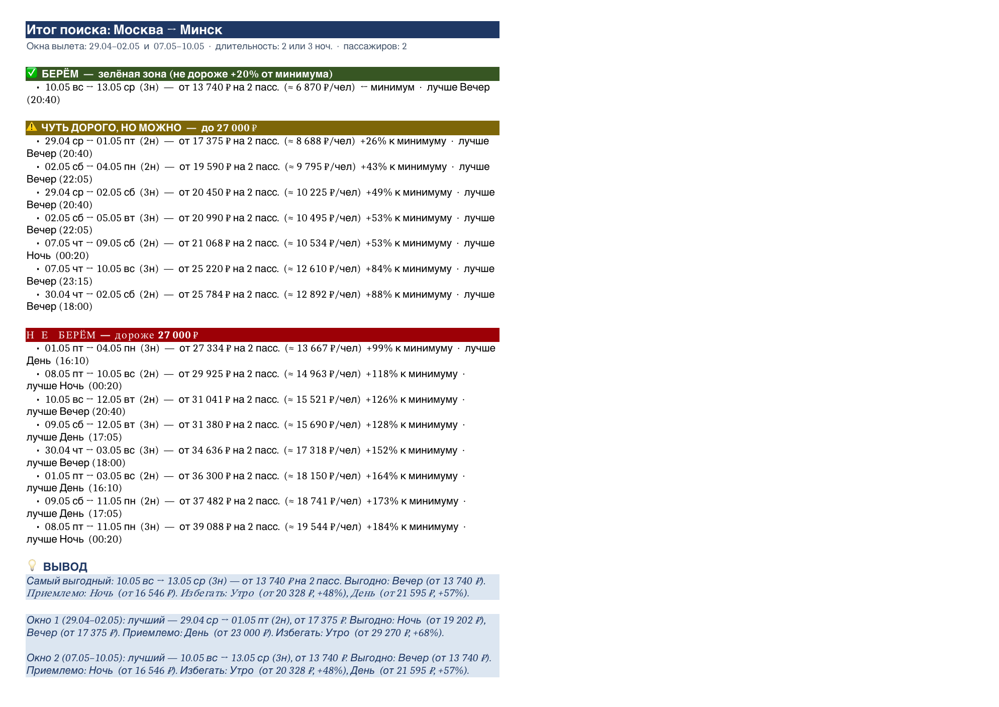
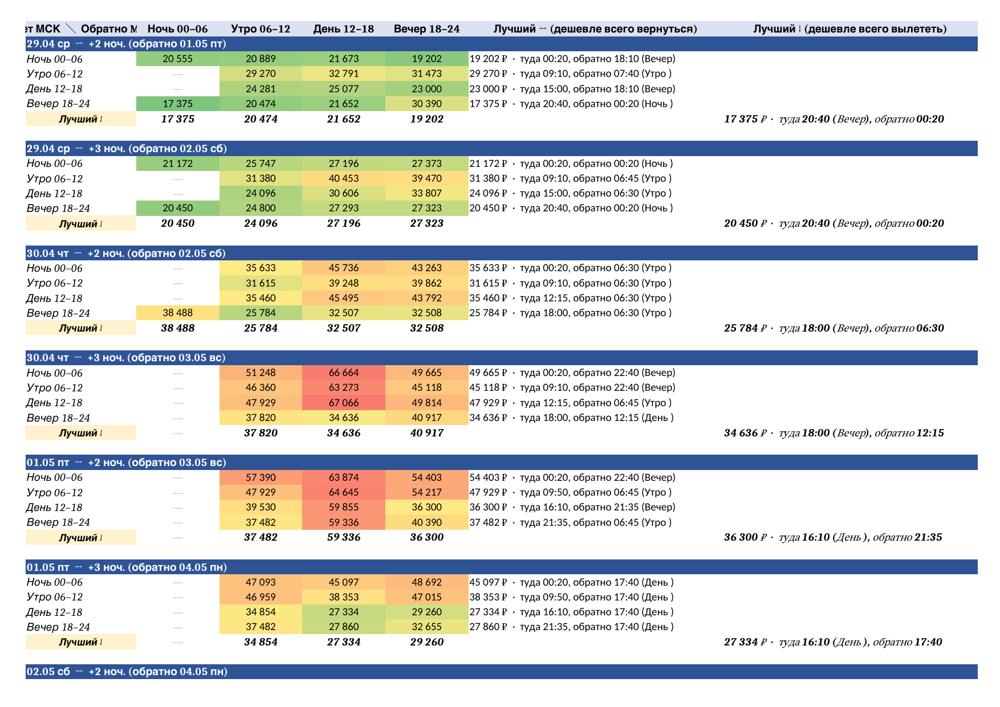
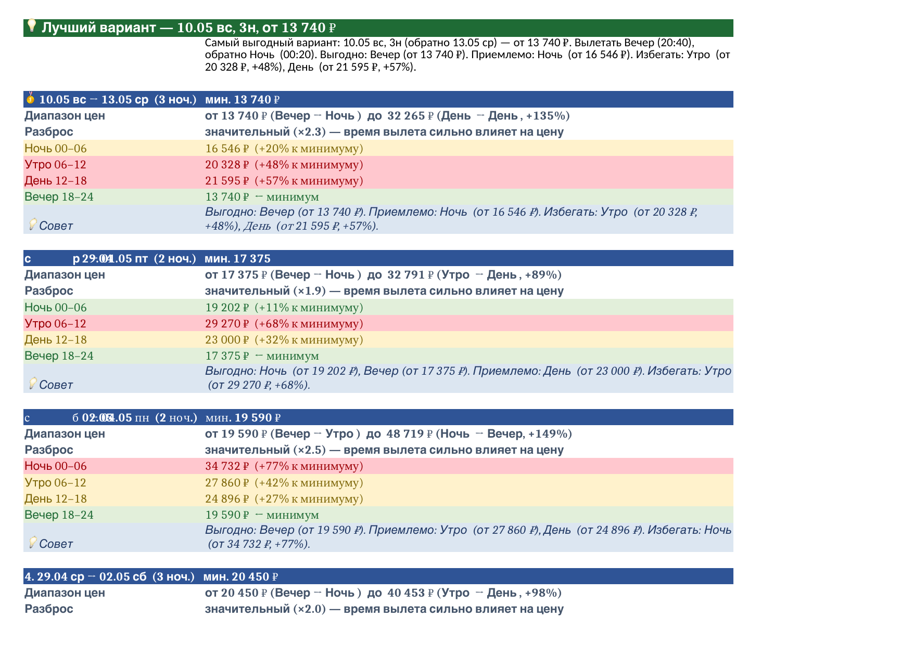

# Aviasales Parser

Парсер Aviasales для поиска билетов на multi-city маршруты. Автоматизирует перебор комбинаций дат, парсит цены через Playwright и строит многостраничный Excel с аналитикой.

## Как это выглядит

Итоговый Excel — главные вкладки (на примере маршрута Москва → Минск).

### Вкладка «Итог»

Берём / чуть дорого / не берём — по порогу `бюджет_макс`, лучшие варианты с ценой на человека и вывод по каждому окну вылета:



### Вкладка «По времени вылета»

2D-сетка: слот вылета туда × слот вылета обратно → минимальная цена, с цветовой шкалой и колонками «Лучший»:



### Вкладка «Рек — Карточки»

Детальная карточка на каждую комбинацию «дата + ночи», отсортированы по цене, с разбросом цен по слотам и советом:



## Быстрый старт

```bash
# Установка
npm install
npx playwright install chromium

# 1. Посмотреть комбинации дат (без запуска браузера)
node generate-trips.js

# 2. Запустить парсинг (откроется браузер — решить капчу на первой странице)
node generate-trips.js --run

# 3. Собрать итоговый Excel
node build-summary.js
```

## Конфигурация

Все параметры — в одном файле `trip-config.json`:

```json
{
  "маршрут": {
    "города":    ["MOW", "TBS", "MOW"],
    "названия":  ["Москва", "Тбилиси", "Москва"],
    "пассажиры": 2
  },
  "даты": {
    "окна_вылета": [
      { "от": "10.06", "до": "11.06" }
    ]
  },
  "ночи": { "мин": 2, "макс": 6 },
  "бюджет_макс": null,
  "критерии": {
    "MOW_TBS": "любой",
    "TBS_MOW": "любой"
  }
}
```

- Маршрут, названия городов и окна вылета — любые: заголовки вкладок, фильтр файлов и пояснения подстраиваются под `trip-config.json` автоматически.
- `бюджет_макс` — порог «не берём» на вкладке «Итог» (в рублях). `null` — порог считается автоматически: минимальная найденная цена +45%.

## Архитектура

```
trip-config.json          ← единственный источник параметров
       ↓
generate-trips.js         ← генерирует комбинации дат и URL Aviasales
       ↓  (--run)
aviasales-parser.js       ← открывает браузер, парсит каждый URL, сохраняет xlsx/json/png
       ↓
build-summary.js          ← читает все свежие xlsx из output/, строит итоговый Excel
```

## Выходные файлы

Сохраняются в `output/`:

```
as_2904-0105_MOW-MSQ-MOW_04-22_16-15.xlsx   ← Excel на один поиск
as_2904-0105_MOW-MSQ-MOW_04-22_16-15.json   ← JSON с сырыми данными
as_2904-0105_MOW-MSQ-MOW_04-22_16-15.png    ← скриншот страницы
as_СВОДКИ_Москва-Минск_04-22_19-10.xlsx     ← итоговый Excel (все комбинации)
```

При повторном запуске `build-summary.js` берёт только последний файл для каждой комбинации дат — старые не мешают.

## Вкладки итогового Excel

| Вкладка | Описание |
|---------|----------|
| **Итог** 🟠 | Берём / чуть дорого / не берём по порогу `бюджет_макс`. Лучшие варианты с ценой на человека. |
| **По времени вылета** 🟡 | 2D-сетка: слот вылета туда × слот вылета обратно → мин. цена. |
| **Рек - Карточки** 🟢 | Детальные карточки на каждую дату, отсортированные по цене. |
| **Рек - Таблица** 🟢 | Все варианты в одной таблице, сортировка по цене. |
| **Рек - По дате** 🟢 | Все варианты, сортировка хронологически. |
| **Рек - По окнам** 🟢 | Анализ по окнам вылета: лучший вариант на каждый день. |
| По датам | Матрица дата вылета × ночи → мин. цена. |
| Все варианты | Все рейсы по возрастанию цены. |
| Все сводки | Сырые данные из каждого отдельного поиска. |
| Пояснения | Расшифровка всех вкладок и терминов. |

## Формат URL Aviasales

```
MOW2904MSQ0105MOW2
│  │   │  │   │
│  │   │  │   └── количество пассажиров
│  │   │  └────── дата вылета из MSQ (DDMM)
│  │   └───────── город 2
│  └───────────── дата вылета из MOW (DDMM)
└──────────────── город 1
```

## Зависимости

- [Playwright](https://playwright.dev/) — автоматизация браузера
- [ExcelJS](https://www.npmjs.com/package/exceljs) — генерация итогового Excel
- [xlsx](https://www.npmjs.com/package/xlsx) — чтение промежуточных файлов
